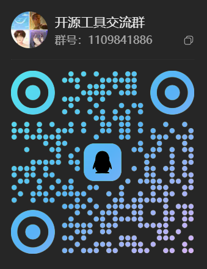

# jumeng-media

DeepSeek Harness 插件：对接 [聚梦 AI](https://www.jumengai.com/)，在对话中生成**图片**与**视频**，结果落盘到本地并返回远程链接。

- 官网：[https://www.jumengai.com/](https://www.jumengai.com/)
- 海外官网：[https://www.jumai.ai/](https://www.jumai.ai/)
- 文档：[https://doc.jumengai.com/guide/intro](https://doc.jumengai.com/guide/intro)
- 仓库：[lkw2731938298/jumeng-image-video-tool](https://github.com/lkw2731938298/jumeng-image-video-tool)

## 功能

| Tool | 作用 |
| --- | --- |
| `list_models` | 列出可用模型（`image` / `video`） |
| `upload_file` | 上传本地图片 / 视频，换取临时参考 URL |
| `generate_image` | 文生图 / 图生图；落盘 + URL |
| `generate_video` | 文生视频 / 图生视频；轮询完成后落盘 + URL |

## 参考素材

`generate_image` 的 `image` 与 `generate_video` 的 `image` / `images` 都接受三种写法：

- **http(s) URL**：直接透传给生成接口
- **本地文件路径**：读盘后经 `POST {baseUrl}/files/upload` 上传，用返回的 URL 生成
- **base64 / data URL**：解码后同样先上传

类型与大小按上传接口的限制校验：图片 JPEG / PNG / GIF / WEBP 最大 10MB，视频 MP4 / MOV / WebM 最大 100MB；不符合的会在发请求前报错。上传得到的 URL 约 **1 小时** 后失效，同一密钥每小时最多 50 个文件。

需要一份素材复用多次时，可先显式调用 `upload_file` 拿到 URL，再传给多次生成调用。

## 安装

任选其一：

```bash
# 从 GitHub 安装
dsh plugin --profile web add https://github.com/lkw2731938298/jumeng-image-video-tool.git

# 或从本地 / 打包文件安装
dsh plugin --profile web add ./jumeng-media
dsh plugin --profile web add ./jumeng-media-0.1.1.tgz
```

安装后重启或刷新 Web UI。

## 配置 API 密钥

1. 打开 Web UI  
2. **设置 → 插件 → 插件配置**  
3. 展开 **聚梦媒体**  
4. 粘贴 API 密钥后 **保存**（写入凭据库，不会进设置明文文件）

也可设置环境变量 `JUMENG_API_KEY`。

## 使用方式

在对话里直接提需求，例如：

- 「用聚梦列一下生图模型」
- 「生成一张赛博城市夜景」
- 「用这张图生成一段 5 秒竖屏视频」

默认输出目录：`./outputs`（相对当前工作区）。

## 配置字段

| 字段 | 说明 |
| --- | --- |
| `apiKey` | 字面量密钥（secret；优先用 Web UI 凭据） |
| `apiKeyEnv` | 凭据引用名，默认 `JUMENG_API_KEY` |
| `baseUrl` | 默认 `https://www.jumengai.com/v1`；国际站改为 `https://www.jumai.ai/v1` |
| `imageModel` / `videoModel` | 可选默认模型 |
| `outputDir` | 默认 `./outputs` |
| `imageTimeoutMs` | 生图请求超时，默认 300000 |
| `videoPollIntervalMs` / `videoTimeoutMs` | 视频轮询间隔与最长等待，默认 10000 / 900000 |
| `uploadTimeoutMs` | 参考素材上传超时，默认 120000 |

## 本地开发

```bash
npm install
npm run build
```

`cordis.overlay.example.yml` 为本地覆盖层示例；密钥请走 Web UI / 环境变量，不要写进配置文件。

## 交流群

开源工具交流 QQ 群：**1109841886**



## License

[MIT](./LICENSE)
